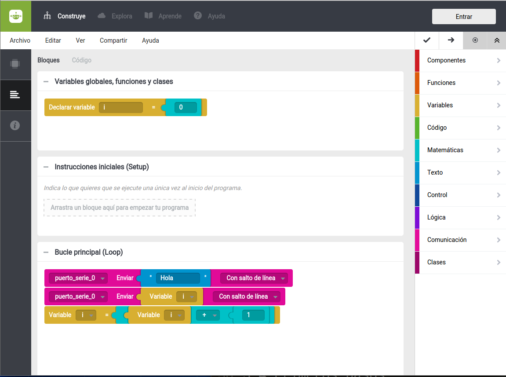

Como hemos visto podemos encontrar multitud de ejemplos en el propio IDE de arduino, de ellos podemos aprender la sintaxis y las posibilidades
que el entorno tiene.

Vamos a hacer unos ejemplos nosotros que sin entrar en detalles técnicos nos van a permitir ir haciéndonos con el entorno.

### Programa con contador

Introducimos el siguiente programa en el entorno. En el se irá incrementando la variable i y se enviará su valor al pc por el puerto de
comunicaciones.

    void setup(){
      Serial.begin(9600);
    }

    int i=0;
    void loop() {
      Serial.print("hola ");
      Serial.println(i);
      i=i+1;
    }

Vamos a analizar el programa:

-   Todos los métodos que empiezan con Serial, se refieren a
    comunicaciones con el pc, en la línea Serial.begin(9600) estamos
    diciendo que vamos a iniciar (begin) las comunicaciones a una
    velocidad de 9600bps (bit por segundo). Serial.print lo que lleva a
    continuación al pc. Si utilizamos println le estamos indicando de
    después de imprimir salte a la siguiente línea.
-   Sabemos el método setup se ejecuta sólo al principio una vez para
    configurar todo. El método loop en cambio se ejecuta de forma
    repetitiva, con lo que el resultado será que nuestra variable i se
    va incrementando a cada paso en una unidad (podíamos haber abreviado
    el programa sustituyendo la linea i=i+1; por i++ que significa lo
    mismo

Descargamos el programa

depués de haber comprobado que tenemos bien seleccionado nuestro modelo de placa y el puerto donde está conectada. Una vez descargada, abrimos la consola serie para ver el resultado

Cuidando de que la velocidad seleccionada será la misma que hemos indicado en el programa

Veremos como se producen una sucesión de línea con el texto "hola 1...."

En bitbloq hacemos el siguiente programa

## Tiempos

Podemos ver las líneas se suceden a toda velocidad en el programa anterior. Ahora mismo el micro está funcionando todo lo rápido que puede (la única limitación es la velocidad a la que se envían datos al pc)

Para introducir una pausa podemos usar las funciones delay y delayMicroseconds. Veamos su uso

-   **delay(milisegundos)**: espera el número de milisegundos indicado
-   **delayMicroseconds(microsegundos)**: espera los microsegundos     indicados El número máximo que soporta es 16383

Así con solo introducir la siguiente línea detrás del incremento de la
variable i, conseguiremos que el programa se retrase\

> delay(1000);\

Ya que estamos hablando de tiempo veamos que otras funciones tiene
arduino relacionadas con el mismo:

- **long millis()** : devuelve el número de milisegundos desde que se  encendió la placa. Se vuelve a poner a cero cada 50 días     aproximadamente.
- **long micros()** : devuelve el número de microsegundos desde que se  encendió la placa. Se vuelve a poner a cero cada 70 minutos     aproximadamente. **Tiene una resolución de 4 microsegundos.**

Con todo esto vamos a hacer un programa que envie cada segundo el número de milisegundos que han pasado desde la ultima iteración. Intenta hacerel programa por ti mismo\

Quedaría algo así:

    void setup(){
      Serial.begin(9600);
    }

    long mAnteriores; // Lo usaremos para almacenar el valor anterior\

    void loop() {
      long mActuales=millis(); // leemos el valor actual de millis

      Serial.println(mActuales-mAnteriores);
      // restamos el anterior del actual y esos son los que han pasado**

      mAnteriores=mActuales;
      // guardamos el dato actual para la siguiente iteración

      delay(1000);
    }

### Sonido

Arduino puede reproducir sonido sin más que conectar un altavoz (mejor
un altavoz piezoelectrico de los que tienen los
pcs)

Uno de los terminales del altavoz a la salida digital que usaremos y el otro a GND. Dependiendo de las características del altavoz pudiera ser conveniente usar una resistencia entre el altavoz y la salida digital.

Podemos hacer sonidos con las siguientes funciones:

    tone(pin, frecuencia)
    tone(pin, frequencia, duracion)

-   Genera una señal cuadrada de la frecuencia y duración definidas.

Para afinar las frecuencias a las notas podemos consultar tablas     como esta:

-   Interfiere con algunas funciones de los pines el 3 y 11 (el pwm     que veremos más adelante)

        noTone(pin)

-   detiene la ejecución del tone actual
-   se utiliza para usar varios pines generando sonido

Podemos ver cómo se usan estas funciones en el ejemplo incluido en Arduino sobre el tema. Accederemos a él según la imagen siguiente

En bitbloq existen 2 formas de generar sonidos

-   Reproducir notas musicales: podemos escoger la nota que vamos a  reproducir y su duración
-   Seleccionar la frecuencia exacta que queremos reproducir y su duración

Se propone como ejercicio voluntario realizar alguna canción conocida, preferiblemente algo friki con Arduino. Comparte en los foros tu composición/interpretación.
