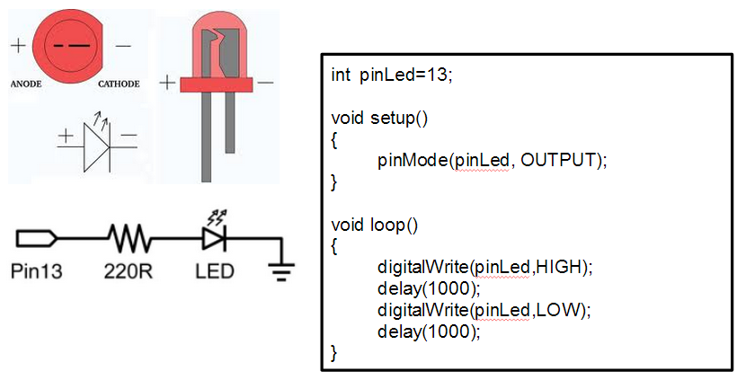

### Múndo digital

En el mundo digital sólo existen dos estados, 0 y 1. Eléctricamente estos estados corresponden con 0 voltios y 5 voltios. En sistemas de bajo
consumo, el estado 1 puede bajar a 3.3 voltios.

En sistemas reales las señales no son realmente como esperamos sino que están mezcladas con ruido. Cómo vemos en la imagen, este ruido complica el reconocer los estados. Para evitar esto se definen un nivel por encima de los cual se toma un valor 1 (la línea roja) y otro por debajo del cual se considera el nivel 0 (la línea azul)

### Salidas digitales

Al activar una patilla como salida, pedimos al micro que intente mantenerla en ese estado, pero dentro de sus posibilidades. Cada patilla puede entregar 40mA (200mW), si el equipo conectado necesita más, arduino no podrá mantener ese estado y la patilla caerá por debajo de los 5v. Si nos pedimos demasiada potencia, estamos forzando la electrónica interna del micro, provocaremos sobrecalentamientos y de hacer continuadamente podemos dañar el micro.

En caso de necesitar más potencia tendremos que usar electrónica suplementaria para poder entregar esa potencia.

Para que nos hagamos una idea, un led necesita unos 25mA.Todas las patillas pueden ser salidas, también las analógicas.

Antes de usar una patilla como salida hemos de decírselo al micro. Lo haremos con la función

    pinMode(pin,OUTPUT);

Para establecer el estado usaremos la función

    digitalWrite(pin,estado);

donde estado puede ser **HIGH** o **LOW**

Siempre que conectemos un LED hemos de usar una resistencia para evitar que le llegue a este demasiado voltaje (un resistencia de 100 o 200
ohmios está bien)

Ahora que ya sabemos manejar las salidas digitales y también sabemos añadir temporizaciones podemos construir un semáforo. Para ello solo habrá que conectar 3 LEDS de distintos colores (cada uno con su resistencia) en 3 pines diferentes.

Como ayuda vamos a ver el caso de un Led conectado al pin 13 que parpadea cada segundo (el parpadeo debe de sincronizarse con el led de la placa)

El montaje en una placa arduino sería el siguiente, utilizando la salida digital 9

\

Podemos hacer más ejemplos conectando más leds a diferentes pines. Cómo sabemos usar esperas y retardos podremos hacer un semáforo!! Comparte tu
montaje en los foros.

Pista: basta alternar las instrucciones en las que se enciende un led concreto con una espera y el apagado del anterior)

### Entradas digitales

Cuando usamos una patilla como entrada digital, Arduino decidirá si el voltaje de la patilla tiene un valor u otro. Hay que tener cuidado de cómo y qué conectamos pues podríamos dañar la placa.

La forma en la conectamos la entrada (un interruptor en este caso ) a la patilla suele ser la siguiente

Podríamos pensar que la resistencia no es necesaria, pero no es así. Si no estuviera puesta, cuando el interruptor estuviera abierto, la patilla
no estaría conectada a nada y por sus características electronicas
actuaría como una antena recogiendo señales electricas y cambiara de
estado casi aleatoriamente.

En esta forma de conexión decimos que las entradas están conectadas con resistencias Pull down, pues la resitancia pone el valor a 0 (al estar
conectado a tierra). Si estuviera conectado a 5V diramos que tiene
resistencias Pull Up.

Para indicar a Arduino que vamos a usar una patilla como entrada
usaremos la función

    pinMode(pin,INPUT);

y para leer el valor usaremos

    digitalRead(pin);

El montaje sería como el siguiente, utilizando la entrada 2:

Existen interruptores que tienen 2 juegos de contactos (4 conectores) que funcionan de forma independiente. Antes de usar el interruptor hay que saber la configuración y cuales son los pines del interruptor que se han de usar.

El mundo digital de los microcontroladores va a una velocidad muy alta (sabemos que arduino funciona a 16MHz, lo que quiere decir que ejecuta
del orden de los 16.000.000 de instrucciones por segundo). Con esas velocidad tan elevadas lo que para nosotros es pulsar un interruptor,
para el micro pueden ser muchas conexiones/desconexiones debidas a pequeñas irregularidades de los contactos y de pequeñas chispas que saltan entre ellos.

Por esto siempre que leemos un valor debemos introducir un pequeño retardo para evitar estos errores. Es lo que se suele llamar "debouncing" (evitar rebotes)

Veamos un ejemplo

Veamos este programa en bitbloq

Como ejemplo podéis hacer un programa que cambie el estado de un led con cada pulsación. Para ello tendríamos que mantener el estado del led en una variable y cambiar éste con cada nueva pulsación. En este caso quedará más patente el efecto de los falsos contactos del pulsador.

Basta con introducir un pequeño retardo de 10ms para evitarlo. Comparte en los foros la solución

Otra práctica interesante puede ser hacer un timbre, que para eso ya sabemos hacer sonidos. Comparte en los foros tu montaje.
