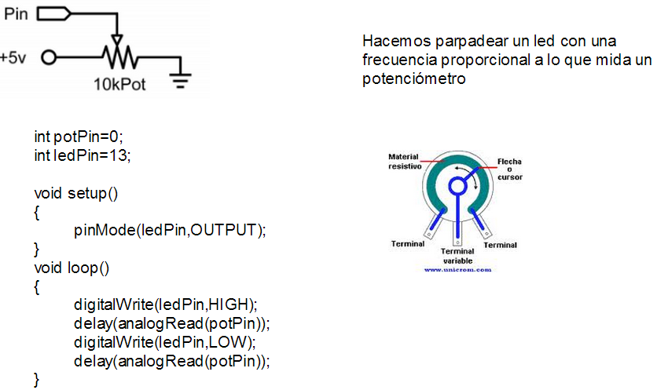
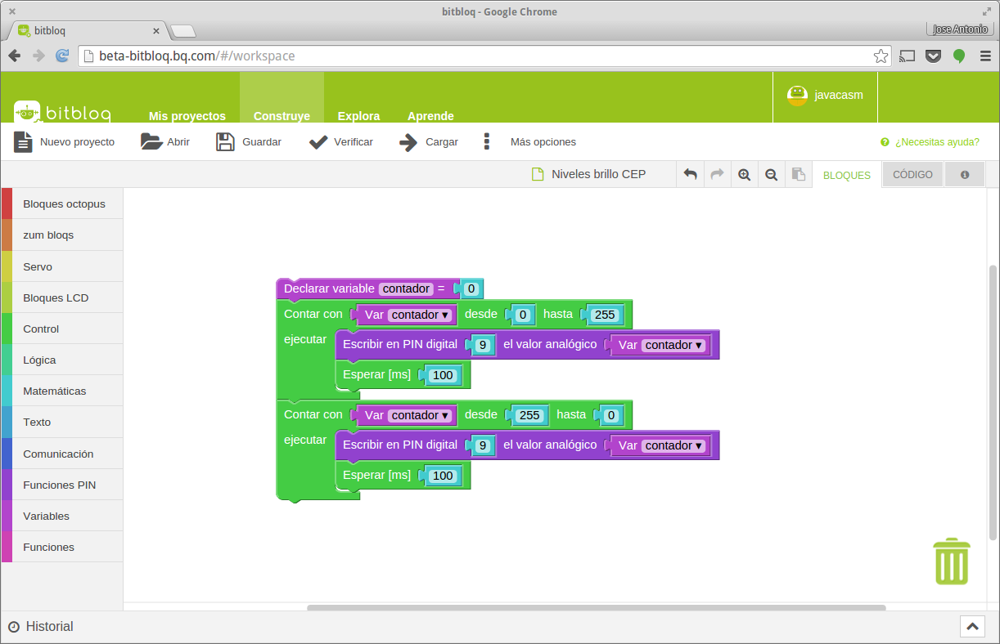

## Entradas y salidas analógicas

En electrónica, algo analógico significa algo que puede variar entre dos niveles de manera continua. En nuestro caso esos niveles serán normalmente 0v y 5v (aunque como veremos en el apéndice de sensores eso se puede cambiar)

### Entradas analógicas

Arduino proporciona varias (6 en Arduino UNO) patillas con capacidad para leer valores analógicos. Cuando leamos un valor tenemos una resolución de 10bits, lo que quiere decir que podremos obtener valores entre 0 y 1023.

Leeremos estos valores con la funcion:

    int valor=analogRead(pin);

Hagamos un ejemplo:

Veremos como al girar el potenciómetro, cambia la frecuencia de parpadeo del led.

El montaje de un potenciómetro sería como el siguiente

Como ejercicio voluntario podemos hacer que el valor de un potenciómetro cambie la frecuencia o duración de un tono emitido. Comparte en los foros su montaje y programa.

En muchas ocasiones necesitamos convertir el valor inicial a una escala concreta. La función map permite re-escalar (proporcionalmente) un valor desde un rango inicial hasta un rango final.

    valorConvertido=map(valorInicial,minimoRangoInicial,maximoRangoInicial,minimoRangoFinal,maximoRangoFinal);

Imagínate que tienes un sensor del que lees valores entre 50 y 100.
Quieres iluminar un led en todo su rango analógico que es 0 255.

Haríamos lo siguiente:

    int valorSensor=analogRead(pinSensor);

    int valorLed=map(valorSensor,50,100,0,255);

De esta manera tendremos el valor convertido. Podrías hacer ese cálculo con una regla de proporcionalidad, pero mejor usar algo bien probado.

Los rangos se pueden poner con el mínimo y el máximo invertido, así conseguiremos una proporcionalidad inversa, es decir cuando más grande sea el valor original más pequeño será el valor convertido.

## Salidas analógicas

Una salida analógica es aquella capaz de dar un valor intermedio entre sus límites. La mayoría de los Arduinos no es capaz de hacer eso (sólo el DUE), pero si puede simularlo. Lo que realmente nos interesa la mayor parte de las veces es modular la potencia que enviamos por una patilla (que tiene casi el mismo efecto sobre cargas reales). Así si queremos una salida al 50% lo que haremos será tener la patilla a 1 el 50% del tiempo y a 0 el otro 50%. Haciéndolo suficiencientemente rápido no se nota la diferencia.

Podremos usar como salidas analógicas aquellas etiquetadas con el símbolo **~** y podremos darle valores entre 0 y 255.

Usaremos la función

    analogWrite(pin, valor);

Esta modulación de la potencia en el tiempo se conoce como PWM

Veámoslos en un vídeo que grabamos en otro curso de arduino, donde podemos ver como la señal (en la pantalla del osciloscopio se ven 5 de estas señales para hacer más claro el efecto) va cambiando. El programa iba cambiando el valor de la patilla entre 0 y 255 de forma continua.
Esta señal se le aplica a un led.

<iframe width="1280" height="720" frameborder="0" src="http://www.youtube.com/embed/lKHofdHzIDs"></iframe>

Vamos a hacer un programa que vaya encendiendo progresivamente un led y luego lo vaya apagando poco a poco.

El montaje es idéntico al de una salida digital, sólo que hay que elegir un pin que permite usar PWM (indicados con **~**)

#### Desde bitbloq

#### LED RGB

Un led RGB es un led que internamente tiene 3 led. Normalmente tiene uno rojo, uno verde y un azul (de ahí el nombre Red,Green,Blue). Se unen una de las patillas de cada uno en una patilla común dejando los otros 3 terminales separado.

Por esto hay 2 tipos de diodos RGB: los de ánodo común y los cátodo común. Esto se debe a que dependiendo de cual de las patillas se haya unido.

La diferencia es que en unos tienes que aplicar voltaje positivo a los terminales (mayor que los 0v que hay en el común)de los colores y en los otros voltaje negativo (menor a los 5V que hay en el común).

Podemos usar los pines PWM para hacer combinaciones de color mezclándolos a distintas intensidades.

Usaríamos 3 salidas pwm (por ejemplo la 9,10 y 11 que están marcadas con el **~** de PWM en la placa) que conectamos a los pines R,G y B y a
tierra.

Usando instrucciones del estilo:

    analogWrite(pinRojo, nivelRojo);
    analogWrite(pinVerde, nivelVerde);
    analogWrite(pinAzul, nivelAzul);

con valores de nivelRojo, nivelVerde y nivelAzul entre 1 y 255

Dependiendo de que sean de cátodo o de ánodo común usaremos **analogWrite(ledColor, color)** y en los otros **analogWrite(ledColor, 255 -
color)**

Como ejercicio voluntario se propone hacer un programa que vaya encendiendo un led a medida que modificamos el valor de una entrada analógica a la que está conectado un potenciómetro. Comparte en los foros tu proyecto.
